Granulosa cell dynamics
================

# Dependencies

``` r
library(Seurat)
```

    ## Loading required package: ggplot2

    ## Loading required package: cowplot

    ## 
    ## Attaching package: 'cowplot'

    ## The following object is masked from 'package:ggplot2':
    ## 
    ##     ggsave

    ## Loading required package: Matrix

``` r
library(destiny)
library(dplyr)
```

    ## 
    ## Attaching package: 'dplyr'

    ## The following objects are masked from 'package:stats':
    ## 
    ##     filter, lag

    ## The following objects are masked from 'package:base':
    ## 
    ##     intersect, setdiff, setequal, union

``` r
library(viridis)
```

    ## Loading required package: viridisLite

# Load the data

``` r
mca.matrix <- readRDS("~/Data/single_cell_datasets/MCA/MCA_merged_mat.rds")
mca.meta <- read.csv("~/Data/single_cell_datasets/MCA/MCA_All-batch-removed-assignments.csv", 
                     row.names = 1)
ovary.samples <- rownames(mca.meta)[which(mca.meta$Tissue == "Ovary")]
ovary.meta <- mca.meta[ovary.samples,]
ovary.matrix <- mca.matrix[,ovary.samples]

rm(mca.matrix, mca.meta)
```

``` r
ovary <- CreateSeuratObject(raw.data = ovary.matrix, meta.data=ovary.meta,
                            min.cells = 3, project = "Ovary")
```

# QC

``` r
mito.genes <- grep(pattern = "^mt-", x = rownames(x = ovary@data), value = TRUE)
percent.mito <- Matrix::colSums(ovary@raw.data[mito.genes, ])/Matrix::colSums(ovary@raw.data)

ovary <- AddMetaData(object = ovary, metadata = percent.mito, col.name = "percent.mito")
VlnPlot(object = ovary, features.plot = c("nGene", "nUMI", "percent.mito"), nCol = 3)
```

<!-- -->

``` r
par(mfrow = c(1, 2))
GenePlot(object = ovary, gene1 = "nUMI", gene2 = "percent.mito")
GenePlot(object = ovary, gene1 = "nUMI", gene2 = "nGene")
```

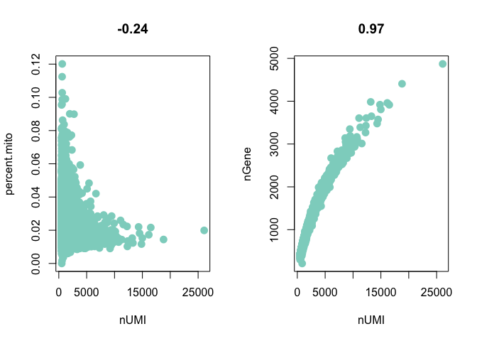<!-- -->

# Filtering

``` r
ovary <- FilterCells(object = ovary, subset.names = c("nGene", "percent.mito"), 
    low.thresholds = c(200, -Inf), high.thresholds = c(3500, 0.06))
```

# Normalize

``` r
ovary <- NormalizeData(object = ovary, normalization.method = "LogNormalize", 
    scale.factor = 10000)
```

``` r
ovary <- FindVariableGenes(object = ovary, mean.function = ExpMean, 
                          dispersion.function = LogVMR,
                          x.low.cutoff = 0.0125, x.high.cutoff = 5, 
                          y.cutoff = 0.5)
```

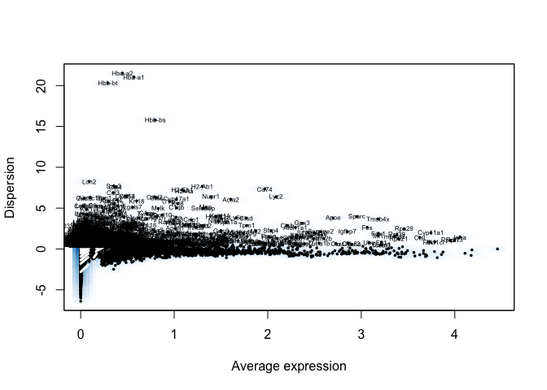<!-- -->

``` r
length(x = ovary@var.genes)
```

    ## [1] 3015

# Regressing out technical variables

``` r
ovary <- ScaleData(object = ovary, vars.to.regress = c("nUMI", "percent.mito"))
```

    ## [1] "Regressing out nUMI"         "Regressing out percent.mito"
    ## 
      |                                                                       
      |                                                                 |   0%
      |                                                                       
      |                                                                 |   1%
      |                                                                       
      |=                                                                |   1%
      |                                                                       
      |=                                                                |   2%
      |                                                                       
      |==                                                               |   2%
      |                                                                       
      |==                                                               |   3%
      |                                                                       
      |==                                                               |   4%
      |                                                                       
      |===                                                              |   4%
      |                                                                       
      |===                                                              |   5%
      |                                                                       
      |====                                                             |   5%
      |                                                                       
      |====                                                             |   6%
      |                                                                       
      |====                                                             |   7%
      |                                                                       
      |=====                                                            |   7%
      |                                                                       
      |=====                                                            |   8%
      |                                                                       
      |======                                                           |   9%
      |                                                                       
      |======                                                           |  10%
      |                                                                       
      |=======                                                          |  10%
      |                                                                       
      |=======                                                          |  11%
      |                                                                       
      |========                                                         |  12%
      |                                                                       
      |========                                                         |  13%
      |                                                                       
      |=========                                                        |  13%
      |                                                                       
      |=========                                                        |  14%
      |                                                                       
      |==========                                                       |  15%
      |                                                                       
      |==========                                                       |  16%
      |                                                                       
      |===========                                                      |  16%
      |                                                                       
      |===========                                                      |  17%
      |                                                                       
      |===========                                                      |  18%
      |                                                                       
      |============                                                     |  18%
      |                                                                       
      |============                                                     |  19%
      |                                                                       
      |=============                                                    |  20%
      |                                                                       
      |=============                                                    |  21%
      |                                                                       
      |==============                                                   |  21%
      |                                                                       
      |==============                                                   |  22%
      |                                                                       
      |===============                                                  |  23%
      |                                                                       
      |===============                                                  |  24%
      |                                                                       
      |================                                                 |  24%
      |                                                                       
      |================                                                 |  25%
      |                                                                       
      |=================                                                |  26%
      |                                                                       
      |=================                                                |  27%
      |                                                                       
      |==================                                               |  27%
      |                                                                       
      |==================                                               |  28%
      |                                                                       
      |===================                                              |  29%
      |                                                                       
      |===================                                              |  30%
      |                                                                       
      |====================                                             |  30%
      |                                                                       
      |====================                                             |  31%
      |                                                                       
      |=====================                                            |  32%
      |                                                                       
      |=====================                                            |  33%
      |                                                                       
      |======================                                           |  34%
      |                                                                       
      |=======================                                          |  35%
      |                                                                       
      |=======================                                          |  36%
      |                                                                       
      |========================                                         |  37%
      |                                                                       
      |=========================                                        |  38%
      |                                                                       
      |=========================                                        |  39%
      |                                                                       
      |==========================                                       |  40%
      |                                                                       
      |===========================                                      |  41%
      |                                                                       
      |===========================                                      |  42%
      |                                                                       
      |============================                                     |  43%
      |                                                                       
      |=============================                                    |  44%
      |                                                                       
      |=============================                                    |  45%
      |                                                                       
      |==============================                                   |  46%
      |                                                                       
      |===============================                                  |  47%
      |                                                                       
      |===============================                                  |  48%
      |                                                                       
      |================================                                 |  49%
      |                                                                       
      |================================                                 |  50%
      |                                                                       
      |=================================                                |  51%
      |                                                                       
      |==================================                               |  52%
      |                                                                       
      |==================================                               |  53%
      |                                                                       
      |===================================                              |  54%
      |                                                                       
      |====================================                             |  55%
      |                                                                       
      |====================================                             |  56%
      |                                                                       
      |=====================================                            |  57%
      |                                                                       
      |======================================                           |  58%
      |                                                                       
      |======================================                           |  59%
      |                                                                       
      |=======================================                          |  60%
      |                                                                       
      |========================================                         |  61%
      |                                                                       
      |========================================                         |  62%
      |                                                                       
      |=========================================                        |  63%
      |                                                                       
      |==========================================                       |  64%
      |                                                                       
      |==========================================                       |  65%
      |                                                                       
      |===========================================                      |  66%
      |                                                                       
      |============================================                     |  67%
      |                                                                       
      |============================================                     |  68%
      |                                                                       
      |=============================================                    |  69%
      |                                                                       
      |=============================================                    |  70%
      |                                                                       
      |==============================================                   |  70%
      |                                                                       
      |==============================================                   |  71%
      |                                                                       
      |===============================================                  |  72%
      |                                                                       
      |===============================================                  |  73%
      |                                                                       
      |================================================                 |  73%
      |                                                                       
      |================================================                 |  74%
      |                                                                       
      |=================================================                |  75%
      |                                                                       
      |=================================================                |  76%
      |                                                                       
      |==================================================               |  76%
      |                                                                       
      |==================================================               |  77%
      |                                                                       
      |===================================================              |  78%
      |                                                                       
      |===================================================              |  79%
      |                                                                       
      |====================================================             |  79%
      |                                                                       
      |====================================================             |  80%
      |                                                                       
      |=====================================================            |  81%
      |                                                                       
      |=====================================================            |  82%
      |                                                                       
      |======================================================           |  82%
      |                                                                       
      |======================================================           |  83%
      |                                                                       
      |======================================================           |  84%
      |                                                                       
      |=======================================================          |  84%
      |                                                                       
      |=======================================================          |  85%
      |                                                                       
      |========================================================         |  86%
      |                                                                       
      |========================================================         |  87%
      |                                                                       
      |=========================================================        |  87%
      |                                                                       
      |=========================================================        |  88%
      |                                                                       
      |==========================================================       |  89%
      |                                                                       
      |==========================================================       |  90%
      |                                                                       
      |===========================================================      |  90%
      |                                                                       
      |===========================================================      |  91%
      |                                                                       
      |============================================================     |  92%
      |                                                                       
      |============================================================     |  93%
      |                                                                       
      |=============================================================    |  93%
      |                                                                       
      |=============================================================    |  94%
      |                                                                       
      |=============================================================    |  95%
      |                                                                       
      |==============================================================   |  95%
      |                                                                       
      |==============================================================   |  96%
      |                                                                       
      |===============================================================  |  96%
      |                                                                       
      |===============================================================  |  97%
      |                                                                       
      |===============================================================  |  98%
      |                                                                       
      |================================================================ |  98%
      |                                                                       
      |================================================================ |  99%
      |                                                                       
      |=================================================================|  99%
      |                                                                       
      |=================================================================| 100%
    ## Time Elapsed:  1.33422065178553 mins
    ## [1] "Scaling data matrix"
    ## 
      |                                                                       
      |                                                                 |   0%
      |                                                                       
      |====                                                             |   6%
      |                                                                       
      |========                                                         |  12%
      |                                                                       
      |===========                                                      |  18%
      |                                                                       
      |===============                                                  |  24%
      |                                                                       
      |===================                                              |  29%
      |                                                                       
      |=======================                                          |  35%
      |                                                                       
      |===========================                                      |  41%
      |                                                                       
      |===============================                                  |  47%
      |                                                                       
      |==================================                               |  53%
      |                                                                       
      |======================================                           |  59%
      |                                                                       
      |==========================================                       |  65%
      |                                                                       
      |==============================================                   |  71%
      |                                                                       
      |==================================================               |  76%
      |                                                                       
      |======================================================           |  82%
      |                                                                       
      |=========================================================        |  88%
      |                                                                       
      |=============================================================    |  94%
      |                                                                       
      |=================================================================| 100%

# Cell cycle classification

``` r
cc.genes <- readLines(con = "~/Data/GeneLists/regev_lab_cell_cycle_genes.txt")
#Split these genes into S markers and G2M markers
s.genes <- cc.genes[1:43]
s.genes <- rownames(ovary.matrix)[which(toupper(rownames(ovary.matrix)) %in% s.genes)]
g2m.genes <- cc.genes[44:97]
g2m.genes <- rownames(ovary.matrix)[which(toupper(rownames(ovary.matrix)) %in% g2m.genes)]
```

``` r
ovary <- CellCycleScoring(object = ovary, s.genes = s.genes, g2m.genes = g2m.genes, set.ident = TRUE)
```

``` r
ovary <- RunPCA(object = ovary, pcs.compute=100, pc.genes = ovary@var.genes, 
                do.print = TRUE, pcs.print = 1:5, genes.print = 5)
```

    ## [1] "PC1"
    ## [1] "Akr1cl"   "Inha"     "Ctsl"     "Serpine2" "Cyb5a"   
    ## [1] ""
    ## [1] "Ctss"   "C1qc"   "Tyrobp" "Fcer1g" "C1qa"  
    ## [1] ""
    ## [1] ""
    ## [1] "PC2"
    ## [1] "Ctsl"     "Ephx2"    "Inha"     "Akr1cl"   "Serpine2"
    ## [1] ""
    ## [1] "Igfbp7" "Col4a2" "Tm4sf1" "Col4a1" "Ifitm3"
    ## [1] ""
    ## [1] ""
    ## [1] "PC3"
    ## [1] "Serpine2" "Inha"     "Bex4"     "Car14"    "Ube2c"   
    ## [1] ""
    ## [1] "Cyp11a1" "Fdx1"    "Me1"     "Gm2a"    "S100a6" 
    ## [1] ""
    ## [1] ""
    ## [1] "PC4"
    ## [1] "Cldn5"  "Ctla2a" "Icam2"  "Ly6c1"  "Esam"  
    ## [1] ""
    ## [1] "Col1a2" "Col3a1" "Acta2"  "Col1a1" "Bgn"   
    ## [1] ""
    ## [1] ""
    ## [1] "PC5"
    ## [1] "Krt19"  "Lgals7" "Krt18"  "Upk3b"  "Krt8"  
    ## [1] ""
    ## [1] "Igfbp7" "Akr1cl" "Acta2"  "Col1a2" "Mgarp" 
    ## [1] ""
    ## [1] ""

``` r
PCAPlot(object=ovary)
```

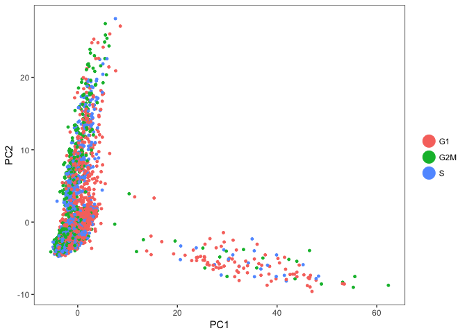<!-- -->

# Any batch effects

Two batches

``` r
ovary <- SetIdent(ovary, ident.use=ovary@meta.data$Batch)
```

``` r
PCAPlot(object=ovary)
```

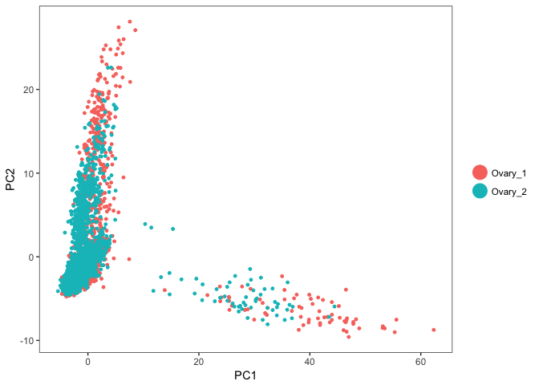<!-- -->

Not apparent by PCA–we’ll see w/ tSNE
later

# Cluster

``` r
PCElbowPlot(object = ovary, num.pc=100)
```

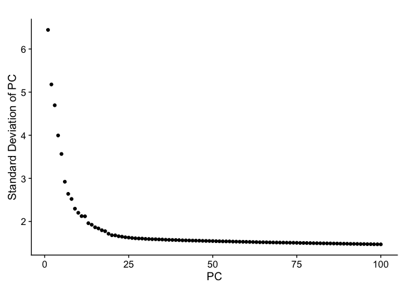<!-- -->

``` r
ovary <- FindClusters(object = ovary, reduction.type = "pca", dims.use = 1:25,
                      resolution = 0.6, print.output = 0, save.SNN = TRUE, 
                      random.seed=2018)
```

# tSNE

``` r
ovary <- RunTSNE(ovary, dims.use = 1:25, do.fast = TRUE)
```

``` r
TSNEPlot(ovary)
```

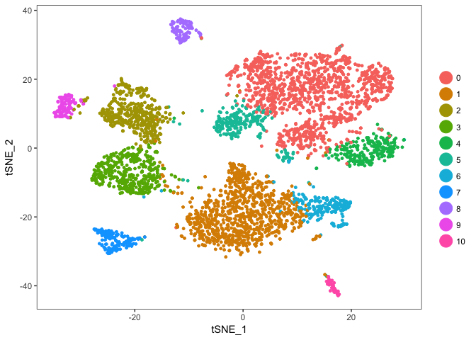<!-- -->

``` r
DimPlot(ovary, group.by="Phase", reduction.use="tsne")
```

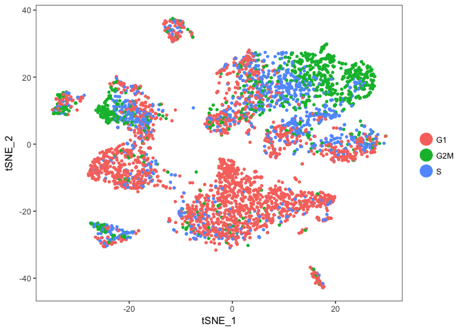<!-- -->

``` r
DimPlot(ovary, group.by="Batch", reduction.use="tsne")
```

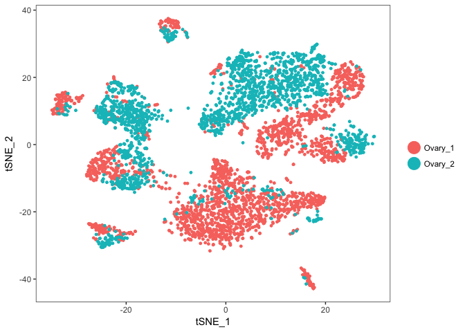<!-- -->

``` r
DimPlot(ovary, group.by="ClusterID", reduction.use="tsne")
```

<!-- -->

Oooo batch effects\! Let’s try to use Seurat’s alignment
procedure

``` r
batch1_cells <- colnames(ovary@data)[which(ovary@meta.data$Batch=="Ovary_1")]
batch2_cells <- colnames(ovary@data)[which(ovary@meta.data$Batch=="Ovary_2")]
ovary.aligned <- RunCCA(ovary, group1=batch1_cells, group2=batch2_cells, num.cc = 30)
```

``` r
p1 <- DimPlot(object = ovary.aligned, reduction.use = "cca", group.by = "Batch", 
    pt.size = 0.5, do.return = TRUE)
p2 <- VlnPlot(object = ovary.aligned, features.plot = "CC1", group.by = "Batch", 
    do.return = TRUE)
plot_grid(p1, p2)
```

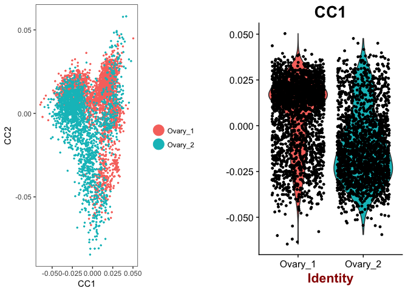<!-- -->

``` r
PrintDim(object = ovary.aligned, reduction.type = "cca", dims.print = 1:2, 
    genes.print = 10)
```

    ## [1] "CC1"
    ##  [1] "Inha"     "Serpine2" "Bex4"     "Car14"    "Ctsl"     "Cyb5a"   
    ##  [7] "Nap1l5"   "Socs2"    "Cnmd"     "Mid1ip1" 
    ## [1] ""
    ##  [1] "Cyp11a1" "Fdx1"    "Me1"     "S100a6"  "Gm2a"    "Mgarp"   "Sparc"  
    ##  [8] "Idh1"    "Sfrp4"   "Prss35" 
    ## [1] ""
    ## [1] ""
    ## [1] "CC2"
    ##  [1] "Igfbp7" "Ifitm3" "Tmsb4x" "Col1a2" "Acta2"  "Rbp1"   "Tm4sf1"
    ##  [8] "Col3a1" "Col4a2" "Bgn"   
    ## [1] ""
    ##  [1] "Ephx2"   "Fdx1"    "Cyp11a1" "Akr1cl"  "Idh1"    "Mgarp"   "Sfrp4"  
    ##  [8] "Chchd10" "Nrn1"    "Gm2a"   
    ## [1] ""
    ## [1] ""

``` r
p3 <- MetageneBicorPlot(ovary.aligned, grouping.var = "Batch", dims.eval = 1:30, 
    display.progress = FALSE)
```

    ## `geom_smooth()` using method = 'loess'

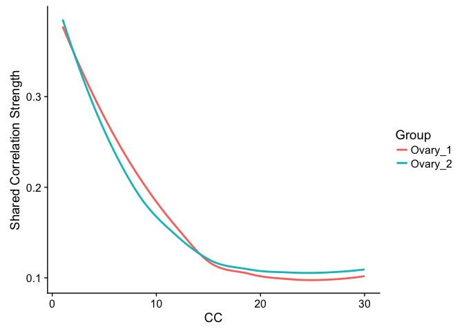<!-- -->

``` r
ovary.aligned <- AlignSubspace(ovary.aligned, reduction.type = "cca", grouping.var = "Batch", 
    dims.align = 1:20)
```

    ## [1] "Scaling data matrix"
    ## 
      |                                                                       
      |                                                                 |   0%
      |                                                                       
      |=================================================================| 100%
    ## [1] "Scaling data matrix"
    ## 
      |                                                                       
      |                                                                 |   0%
      |                                                                       
      |=================================================================| 100%

``` r
p1 <- VlnPlot(object = ovary.aligned, features.plot = "ACC1", group.by = "Batch", 
    do.return = TRUE)
p2 <- VlnPlot(object = ovary.aligned, features.plot = "ACC2", group.by = "Batch", 
    do.return = TRUE)
plot_grid(p1, p2)
```

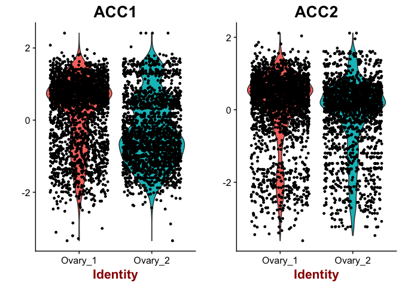<!-- -->

``` r
ovary.aligned <- RunTSNE(ovary.aligned, reduction.use = "cca.aligned", dims.use = 1:20, 
    do.fast = T)
ovary.aligned <- FindClusters(ovary.aligned, reduction.type = "cca.aligned", 
    resolution = 0.6, dims.use = 1:20)
```

``` r
# Visualization
p1 <- TSNEPlot(ovary.aligned, do.return = T, pt.size = 0.5, group.by = "Batch")
p2 <- TSNEPlot(ovary.aligned, do.label = T, do.return = T, pt.size = 0.5)
plot_grid(p1, p2)
```

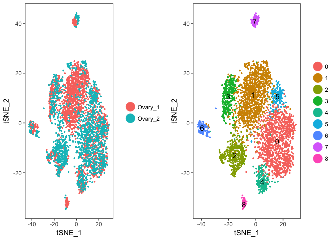<!-- -->

``` r
TSNEPlot(ovary.aligned, do.return = T,group.by = "Batch")
```

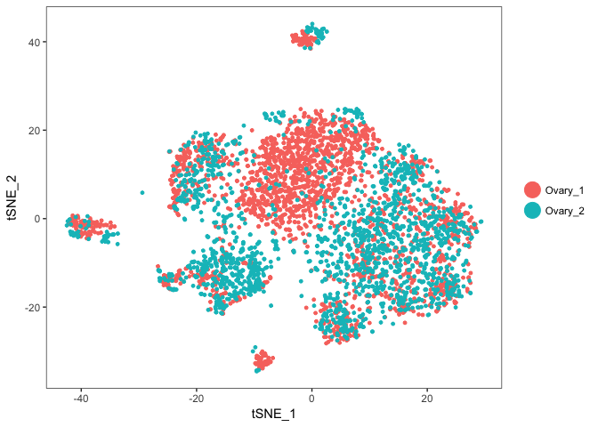<!-- -->

``` r
cluster1.markers <- FindMarkers(object = ovary.aligned, ident.1 = 1, min.pct = 0.25)
print(x = head(x = cluster1.markers, n = 30))
```

    ##                 p_val avg_logFC pct.1 pct.2     p_val_adj
    ## Sfrp4    0.000000e+00 2.4555209 0.700 0.098  0.000000e+00
    ## S100a6   0.000000e+00 2.0372990 0.794 0.239  0.000000e+00
    ## Gm2a     0.000000e+00 2.0153177 0.781 0.219  0.000000e+00
    ## Idh1     0.000000e+00 1.5625117 0.798 0.304  0.000000e+00
    ## Fdx1     0.000000e+00 1.5109982 0.911 0.387  0.000000e+00
    ## Cyp11a1  0.000000e+00 1.4411262 0.951 0.508  0.000000e+00
    ## Lhcgr   1.085063e-276 1.7081372 0.590 0.100 1.776465e-272
    ## Ephx2   2.083397e-275 1.4195104 0.807 0.366 3.410938e-271
    ## Scarb1  1.603541e-271 1.4693253 0.792 0.349 2.625317e-267
    ## Nrn1    1.173637e-269 1.5749901 0.602 0.114 1.921479e-265
    ## Sgk1    8.310947e-255 1.4039453 0.740 0.273 1.360668e-250
    ## Hsd3b1  2.439756e-239 0.8625189 0.974 0.783 3.994369e-235
    ## Bhmt    2.759669e-232 1.5311731 0.426 0.038 4.518131e-228
    ## Epdr1   6.844704e-220 1.2195598 0.476 0.061 1.120615e-215
    ## Fkbp5   1.374777e-218 1.3373420 0.663 0.219 2.250785e-214
    ## Cited4  9.352461e-212 1.3614969 0.566 0.127 1.531185e-207
    ## Me1     7.186876e-210 0.9809035 0.725 0.229 1.176635e-205
    ## Mrap    1.416526e-199 1.2001242 0.512 0.096 2.319137e-195
    ## Avpi1   2.231465e-193 1.1608231 0.461 0.072 3.653355e-189
    ## Prlr    7.394653e-186 1.0983642 0.536 0.115 1.210653e-181
    ## Aes     4.191356e-175 1.1030961 0.666 0.254 6.862088e-171
    ## Cst8    6.313260e-174 1.2770583 0.564 0.164 1.033607e-169
    ## Lrrn1   3.357303e-172 0.9580898 0.303 0.017 5.496576e-168
    ## Plin5   1.298390e-162 0.9393933 0.312 0.024 2.125723e-158
    ## Rora    4.634727e-159 1.0267675 0.366 0.048 7.587975e-155
    ## Kcnab3  1.014067e-154 0.9216993 0.302 0.025 1.660231e-150
    ## Usp50   1.379535e-149 1.0343197 0.450 0.102 2.258575e-145
    ## Npc2    3.611962e-148 0.9166343 0.730 0.369 5.913504e-144
    ## Mgst2   8.223018e-141 0.8067675 0.324 0.039 1.346273e-136
    ## Fam213b 2.838591e-139 0.9211006 0.410 0.083 4.647341e-135

``` r
FeaturePlot(ovary.aligned, features.plot="Fshr", cols.use=viridis(100))
```

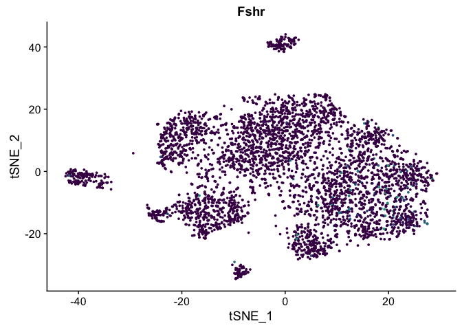<!-- -->

``` r
ovary.markers <- FindAllMarkers(object = ovary.aligned, 
                               min.pct = 0.25, thresh.use = 0.5,
                               print.bar=T, random.seed=2018)
```

``` r
#How many markers per cluster
table(ovary.markers$cluster)
```

    ## 
    ##   0   1   2   3   4   5   6   7   8 
    ## 393 443 335 392 264 254 455 705 352

``` r
top_markers <- ovary.markers %>% group_by(cluster) %>% top_n(1, avg_logFC)
```

``` r
top5 <- ovary.markers %>% group_by(cluster) %>% top_n(5, avg_logFC)
# setting slim.col.label to TRUE will print just the cluster IDS instead of
# every cell name
DoHeatmap(object = ovary.aligned, genes.use = top5$gene, slim.col.label = TRUE, remove.key = TRUE)
```

<!-- -->

``` r
FeaturePlot(object = ovary.aligned, features.plot = top_markers$gene, 
            cols.use = viridis(100), reduction.use = "tsne",
            no.axes=T, pt.size=0.25)
```

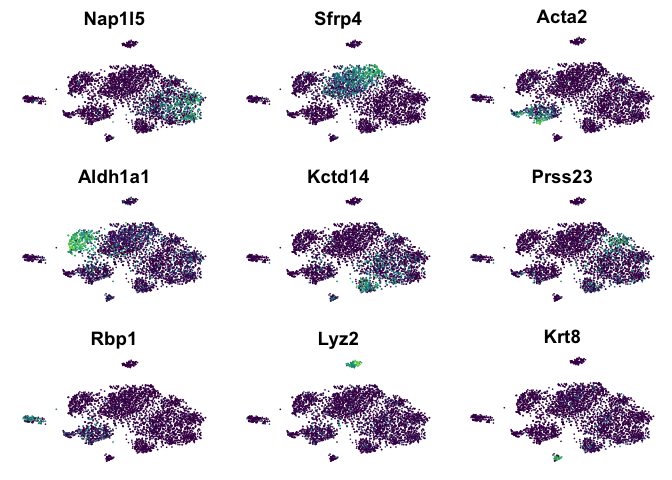<!-- -->

# Mapping to cell types

Okay, so let’s try to assign each cluster to a specific cell
type.

## Cluster 0 - Granulosa

``` r
ovary.markers %>% filter(cluster==0) %>% arrange(desc(avg_logFC)) %>% top_n(50, avg_logFC)
```

    ##            p_val avg_logFC pct.1 pct.2     p_val_adj cluster     gene
    ## 1  7.667017e-242 1.8979667 0.468 0.052 1.255244e-237       0   Nap1l5
    ## 2  1.299035e-221 1.8712013 0.387 0.027 2.126780e-217       0    Inhba
    ## 3   0.000000e+00 1.7988883 0.996 0.744  0.000000e+00       0     Inha
    ## 4  2.922393e-266 1.6952788 0.477 0.039 4.784541e-262       0    Car14
    ## 5   0.000000e+00 1.6131263 0.872 0.292  0.000000e+00       0 Serpine2
    ## 6  3.159522e-224 1.5800891 0.432 0.045 5.172769e-220       0  Hsd17b1
    ## 7  5.024053e-203 1.5642198 0.413 0.046 8.225379e-199       0     Cnmd
    ## 8  1.107725e-300 1.3926933 0.812 0.238 1.813568e-296       0     Bex4
    ## 9  2.669036e-129 1.2577085 0.382 0.088 4.369745e-125       0      Fst
    ## 10 1.377939e-135 1.2370459 0.337 0.053 2.255961e-131       0  Slc38a5
    ## 11 3.820660e-160 1.2089452 0.627 0.240 6.255184e-156       0    Socs2
    ## 12 3.153525e-119 1.1969119 0.500 0.176 5.162951e-115       0  Mid1ip1
    ## 13 3.061383e-154 1.1811080 0.331 0.036 5.012096e-150       0    Apoa4
    ## 14 3.769804e-226 1.1350757 0.902 0.592 6.171923e-222       0    Cyb5a
    ## 15 1.224864e-146 1.1120695 0.519 0.152 2.005348e-142       0    Tnni3
    ## 16 1.808383e-299 1.1066764 0.976 0.774 2.960685e-295       0     Ctsl
    ## 17 8.410386e-118 1.1066499 0.403 0.103 1.376948e-113       0    Foxo1
    ## 18  1.282326e-72 1.0876229 0.331 0.115  2.099425e-68       0    Gsta4
    ## 19 1.307036e-135 1.0746798 0.438 0.105 2.139879e-131       0    Mfap2
    ## 20  2.650504e-97 1.0545794 0.427 0.152  4.339405e-93       0  Prkar2b
    ## 21  9.025405e-84 1.0445558 0.316 0.086  1.477639e-79       0    Ube2c
    ## 22 7.007345e-103 1.0172599 0.467 0.172  1.147243e-98       0    Hjurp
    ## 23  6.544714e-80 0.9509690 0.382 0.134  1.071501e-75       0    Ccnd2
    ## 24 8.998298e-129 0.9478270 0.697 0.382 1.473201e-124       0    Htra1
    ## 25  1.946237e-94 0.9442118 0.559 0.286  3.186379e-90       0     Manf
    ## 26  3.543367e-73 0.9272260 0.473 0.244  5.801201e-69       0     Gja1
    ## 27  7.990940e-84 0.9173039 0.319 0.090  1.308277e-79       0  St3gal4
    ## 28  3.834663e-89 0.8617510 0.565 0.281  6.278110e-85       0     Ucp2
    ## 29  3.533614e-99 0.8371948 0.675 0.433  5.785233e-95       0  Hsp90b1
    ## 30  3.372404e-85 0.8276200 0.274 0.059  5.521300e-81       0    Fbln1
    ## 31  1.235844e-76 0.8270182 0.407 0.156  2.023324e-72       0     Gpx7
    ## 32  7.219904e-65 0.8259176 0.473 0.247  1.182043e-60       0  Carhsp1
    ## 33 2.350662e-101 0.8123296 0.670 0.384  3.848503e-97       0    Pdia6
    ## 34  1.032922e-70 0.7810740 0.360 0.129  1.691100e-66       0    Cks1b
    ## 35  9.456790e-66 0.7788338 0.264 0.071  1.548266e-61       0    Apoa1
    ## 36  1.165355e-69 0.7673992 0.628 0.455  1.907919e-65       0    H2afz
    ## 37  9.746831e-94 0.7586852 0.717 0.494  1.595751e-89       0    Tubb5
    ## 38  8.360321e-62 0.7552442 0.465 0.235  1.368752e-57       0    Prdx4
    ## 39  5.214490e-59 0.7422222 0.399 0.181  8.537163e-55       0    Fscn1
    ## 40  1.253783e-64 0.7411665 0.512 0.284  2.052693e-60       0    Hmgn2
    ## 41  1.129076e-39 0.7392549 0.295 0.138  1.848524e-35       0     Jak1
    ## 42  7.101234e-57 0.7372854 0.663 0.504  1.162614e-52       0     Ldha
    ## 43 2.399411e-121 0.7354662 0.788 0.575 3.928315e-117       0    Hspa5
    ## 44  9.531320e-89 0.7255621 0.738 0.558  1.560468e-84       0   Tuba1b
    ## 45  1.468902e-61 0.7225359 0.286 0.089  2.404886e-57       0    Pclaf
    ## 46  4.954875e-41 0.7058380 0.441 0.274  8.112122e-37       0     Eno1
    ## 47  1.636931e-59 0.6863026 0.661 0.443  2.679983e-55       0     Rgs2
    ## 48  8.506266e-67 0.6841465 0.686 0.487  1.392646e-62       0    Psma2
    ## 49  1.597918e-47 0.6806971 0.327 0.143  2.616111e-43       0      Dut
    ## 50  2.249274e-54 0.6792310 0.516 0.301  3.682511e-50       0    H2afv

Definitely granulosa cells. Not sure of stage just yet. Inhibin
expressed in granulosa cells. This cluster (only one side of it, which
is interesting) also expressed aromatase–the enzyme that converts
androgens to estrogen Most markers I look at increase as you move
towards the bottom right of the cluster–likely corresponds to follicle
size, but not sure the directionality
yet

## Cluster 1 - Luteal? Thecal?

``` r
ovary.markers %>% filter(cluster==1) %>% arrange(desc(avg_logFC)) %>% top_n(50, avg_logFC)
```

    ##            p_val avg_logFC pct.1 pct.2     p_val_adj cluster      gene
    ## 1   0.000000e+00 2.4555209 0.700 0.098  0.000000e+00       1     Sfrp4
    ## 2   0.000000e+00 2.0372990 0.794 0.239  0.000000e+00       1    S100a6
    ## 3   0.000000e+00 2.0153177 0.781 0.219  0.000000e+00       1      Gm2a
    ## 4  1.085063e-276 1.7081372 0.590 0.100 1.776465e-272       1     Lhcgr
    ## 5  1.173637e-269 1.5749901 0.602 0.114 1.921479e-265       1      Nrn1
    ## 6   0.000000e+00 1.5625117 0.798 0.304  0.000000e+00       1      Idh1
    ## 7  2.759669e-232 1.5311731 0.426 0.038 4.518131e-228       1      Bhmt
    ## 8   0.000000e+00 1.5109982 0.911 0.387  0.000000e+00       1      Fdx1
    ## 9  1.603541e-271 1.4693253 0.792 0.349 2.625317e-267       1    Scarb1
    ## 10  0.000000e+00 1.4411262 0.951 0.508  0.000000e+00       1   Cyp11a1
    ## 11 2.083397e-275 1.4195104 0.807 0.366 3.410938e-271       1     Ephx2
    ## 12 8.310947e-255 1.4039453 0.740 0.273 1.360668e-250       1      Sgk1
    ## 13 9.352461e-212 1.3614969 0.566 0.127 1.531185e-207       1    Cited4
    ## 14 1.374777e-218 1.3373420 0.663 0.219 2.250785e-214       1     Fkbp5
    ## 15 6.313260e-174 1.2770583 0.564 0.164 1.033607e-169       1      Cst8
    ## 16 6.844704e-220 1.2195598 0.476 0.061 1.120615e-215       1     Epdr1
    ## 17 1.416526e-199 1.2001242 0.512 0.096 2.319137e-195       1      Mrap
    ## 18 2.231465e-193 1.1608231 0.461 0.072 3.653355e-189       1     Avpi1
    ## 19 4.191356e-175 1.1030961 0.666 0.254 6.862088e-171       1       Aes
    ## 20 7.394653e-186 1.0983642 0.536 0.115 1.210653e-181       1      Prlr
    ## 21 1.154691e-132 1.0440525 0.379 0.077 1.890461e-128       1     Dhcr7
    ## 22 1.379535e-149 1.0343197 0.450 0.102 2.258575e-145       1     Usp50
    ## 23 4.634727e-159 1.0267675 0.366 0.048 7.587975e-155       1      Rora
    ## 24 1.163684e-134 0.9929941 0.540 0.174 1.905184e-130       1  Atp6v0e2
    ## 25 7.186876e-210 0.9809035 0.725 0.229 1.176635e-205       1       Me1
    ## 26 3.357303e-172 0.9580898 0.303 0.017 5.496576e-168       1     Lrrn1
    ## 27 3.000594e-137 0.9458259 0.674 0.301 4.912573e-133       1    Polr2l
    ## 28 1.298390e-162 0.9393933 0.312 0.024 2.125723e-158       1     Plin5
    ## 29 8.278802e-136 0.9369070 0.436 0.099 1.355405e-131       1      Lgmn
    ## 30 1.014067e-154 0.9216993 0.302 0.025 1.660231e-150       1    Kcnab3
    ## 31 2.838591e-139 0.9211006 0.410 0.083 4.647341e-135       1   Fam213b
    ## 32 3.611962e-148 0.9166343 0.730 0.369 5.913504e-144       1      Npc2
    ## 33 5.175140e-121 0.9124354 0.484 0.147 8.472739e-117       1    Pdlim4
    ## 34 3.839666e-124 0.8967137 0.624 0.263 6.286301e-120       1     Med10
    ## 35 1.376574e-117 0.8649384 0.497 0.160 2.253727e-113       1 Tnfrsf12a
    ## 36 2.439756e-239 0.8625189 0.974 0.783 3.994369e-235       1    Hsd3b1
    ## 37 9.959828e-112 0.8612632 0.768 0.455 1.630623e-107       1   Chchd10
    ## 38 1.336409e-128 0.8589796 0.262 0.024 2.187969e-124       1   Hsd17b7
    ## 39 1.184877e-125 0.8580506 0.513 0.155 1.939881e-121       1      Gamt
    ## 40 4.116802e-119 0.8515867 0.432 0.111 6.740028e-115       1      Star
    ## 41 1.437976e-116 0.8466213 0.540 0.191 2.354255e-112       1     Aplp2
    ## 42 2.151292e-112 0.8466009 0.531 0.191 3.522095e-108       1    Elovl5
    ## 43  1.074742e-96 0.8387840 0.585 0.279  1.759567e-92       1      Bzw1
    ## 44 1.105970e-108 0.8169082 0.453 0.138 1.810694e-104       1    Gm2830
    ## 45 8.223018e-141 0.8067675 0.324 0.039 1.346273e-136       1     Mgst2
    ## 46 2.701856e-109 0.7869852 0.462 0.141 4.423479e-105       1    Shisa5
    ## 47 6.904661e-139 0.7774251 0.259 0.017 1.130431e-134       1    Dpysl4
    ## 48 2.265306e-117 0.7762777 0.279 0.036 3.708760e-113       1   Fam126a
    ## 49 2.885676e-106 0.7744925 0.285 0.047 4.724429e-102       1   Gm15543
    ## 50 1.211235e-107 0.7732983 0.628 0.278 1.983034e-103       1      Rgcc

This is a really large cluster. First thing I notice is the LH receptor.
The authors of the MCA annotated this as luteal
cells

## Cluster 2

``` r
ovary.markers %>% filter(cluster==2) %>% arrange(desc(avg_logFC)) %>% top_n(50, avg_logFC)
```

    ##            p_val avg_logFC pct.1 pct.2     p_val_adj cluster     gene
    ## 1   0.000000e+00 2.8494783 0.625 0.054  0.000000e+00       2    Acta2
    ## 2   0.000000e+00 2.5004762 0.641 0.029  0.000000e+00       2   Col1a2
    ## 3  3.005317e-269 2.2743380 0.544 0.048 4.920305e-265       2   Col3a1
    ## 4  3.949791e-162 2.2369093 0.485 0.079 6.466597e-158       2      Mgp
    ## 5  3.137247e-256 2.1751651 0.485 0.034 5.136300e-252       2      Dcn
    ## 6  5.795921e-304 2.1647210 0.948 0.254 9.489082e-300       2   Igfbp7
    ## 7  9.848882e-181 1.9729752 0.746 0.248 1.612459e-176       2     Tpm1
    ## 8  2.101150e-193 1.9397540 0.522 0.072 3.440003e-189       2     Myl9
    ## 9  5.502326e-140 1.9242182 0.326 0.032 9.008408e-136       2     Mylk
    ## 10 3.438555e-240 1.8570409 0.417 0.023 5.629602e-236       2      Bgn
    ## 11 1.068685e-229 1.7803452 0.326 0.008 1.749651e-225       2   Col1a1
    ## 12 1.358128e-151 1.6794226 0.359 0.038 2.223528e-147       2     Tpm2
    ## 13 1.753504e-162 1.5988729 0.367 0.035 2.870837e-158       2     Cygb
    ## 14 5.208719e-151 1.5557550 0.299 0.021 8.527714e-147       2  Sparcl1
    ## 15 9.048889e-143 1.5403842 0.359 0.042 1.481484e-138       2     Cnn2
    ## 16 4.870774e-114 1.5287941 0.315 0.041 7.974430e-110       2    Csrp1
    ## 17 4.782710e-113 1.4932012 0.384 0.064 7.830252e-109       2  Rarres2
    ## 18  3.108751e-76 1.4693942 0.307 0.064  5.089647e-72       2   Col4a1
    ## 19  1.012324e-70 1.4685229 0.295 0.064  1.657378e-66       2   Col4a2
    ## 20 1.784101e-163 1.4518033 0.315 0.021 2.920931e-159       2      Mdk
    ## 21 6.388910e-117 1.4186520 0.573 0.162 1.045992e-112       2   Ifitm3
    ## 22 6.377383e-126 1.3967036 0.417 0.070 1.044105e-121       2    Cald1
    ## 23 1.401464e-138 1.3656431 0.315 0.029 2.294477e-134       2    Fstl1
    ## 24 5.807408e-122 1.1592413 0.897 0.566 9.507889e-118       2    Sparc
    ## 25  6.837182e-55 1.1333765 0.309 0.087  1.119383e-50       2    Smoc2
    ## 26  5.501694e-87 1.1118644 0.788 0.509  9.007373e-83       2   Lgals1
    ## 27  3.641721e-56 1.0755805 0.383 0.127  5.962226e-52       2      Oaf
    ## 28  1.694001e-45 1.0680088 0.509 0.278  2.773418e-41       2     Tpm4
    ## 29  2.189660e-47 1.0449941 0.280 0.081  3.584911e-43       2   Col6a1
    ## 30  4.179431e-26 0.9952867 0.297 0.135  6.842565e-22       2   Phlda1
    ## 31  3.285320e-89 0.9606208 0.829 0.603  5.378725e-85       2 Serpinh1
    ## 32  6.409527e-45 0.9593699 0.408 0.167  1.049368e-40       2     Rcn3
    ## 33  5.051902e-46 0.9503542 0.252 0.067  8.270973e-42       2   Igfbp4
    ## 34  3.211634e-88 0.9476509 0.816 0.543  5.258087e-84       2     Cd63
    ## 35  3.123365e-47 0.9401720 0.260 0.067  5.113574e-43       2     Osr2
    ## 36  2.104394e-77 0.9209787 0.340 0.072  3.445313e-73       2     Rbp1
    ## 37  3.223682e-32 0.8413350 0.318 0.131  5.277813e-28       2     Gpx8
    ## 38  1.270843e-21 0.8341723 0.313 0.164  2.080623e-17       2    Tubb6
    ## 39  2.428405e-12 0.8278824 0.400 0.307  3.975784e-08       2      Vim
    ## 40  1.224534e-36 0.8156410 0.258 0.082  2.004808e-32       2  Prkcdbp
    ## 41  1.208483e-25 0.8075479 0.534 0.353  1.978529e-21       2     Hes1
    ## 42  1.839547e-23 0.7918653 0.390 0.207  3.011706e-19       2   Hspa1a
    ## 43  8.743440e-21 0.7678326 0.256 0.115  1.431476e-16       2    Socs3
    ## 44  2.990665e-19 0.7637275 0.297 0.159  4.896317e-15       2    Sept7
    ## 45  2.834713e-19 0.7387811 0.336 0.192  4.640993e-15       2     Ppic
    ## 46  1.523401e-40 0.7023891 0.755 0.559  2.494112e-36       2      Id3
    ## 47  8.269706e-14 0.6865725 0.301 0.185  1.353916e-09       2      Ilk
    ## 48  3.463890e-17 0.6861747 0.542 0.453  5.671081e-13       2  S100a11
    ## 49  2.313026e-15 0.6667246 0.262 0.135  3.786887e-11       2    Pclaf
    ## 50  9.790183e-17 0.6609267 0.392 0.251  1.602849e-12       2  Gadd45b

Collagens and actins–definitely
stroma

## Cluster 3 - Theca/CL??

``` r
ovary.markers %>% filter(cluster==3) %>% arrange(desc(avg_logFC)) %>% top_n(50, avg_logFC)
```

    ##            p_val avg_logFC pct.1 pct.2     p_val_adj cluster          gene
    ## 1  7.418781e-247 2.6166043 0.940 0.288 1.214603e-242       3       Aldh1a1
    ## 2  2.688455e-151 2.5118856 0.327 0.023 4.401539e-147       3       Cyp17a1
    ## 3  6.119107e-197 2.1956930 0.711 0.138 1.001820e-192       3          Hao2
    ## 4  1.277648e-169 2.0783287 0.417 0.037 2.091766e-165       3          Adh1
    ## 5  7.766629e-285 1.9736289 0.689 0.065 1.271552e-280       3         Fxyd1
    ## 6  7.032438e-172 1.8045572 0.899 0.377 1.151351e-167       3         Mgarp
    ## 7  5.920158e-199 1.6936903 0.490 0.045 9.692483e-195       3         Folr1
    ## 8  9.573219e-126 1.6222526 0.760 0.270 1.567327e-121       3       Dnajc15
    ## 9  7.020833e-222 1.6107641 0.368 0.013 1.149451e-217       3      Serpina5
    ## 10 7.706708e-165 1.5815703 0.447 0.046 1.261742e-160       3       Fam213a
    ## 11 1.018139e-129 1.5623488 0.534 0.102 1.666897e-125       3           Ggh
    ## 12 3.250276e-182 1.5292212 0.395 0.028 5.321352e-178       3         Ephx1
    ## 13 8.314511e-106 1.4914738 0.649 0.196 1.361252e-101       3        Hmgcs2
    ## 14 1.856582e-117 1.4218673 0.826 0.340 3.039595e-113       3           Me1
    ## 15 1.353387e-117 1.4210508 0.820 0.367 2.215765e-113       3        Acsbg1
    ## 16  2.348133e-85 1.4161499 0.632 0.219  3.844364e-81       3          Gas6
    ## 17  3.515431e-37 1.4004216 0.357 0.133  5.755463e-33       3        Osgin1
    ## 18 4.876321e-107 1.3386834 0.869 0.419 7.983513e-103       3         Gstm1
    ## 19  2.069020e-66 1.3073853 0.313 0.063  3.387399e-62       3        Abcb1b
    ## 20  8.301695e-88 1.2832666 0.433 0.092  1.359153e-83       3         Dhrs7
    ## 21  1.434875e-97 1.2719245 0.330 0.045  2.349177e-93       3 E330017L17Rik
    ## 22 1.135756e-113 1.2704856 0.916 0.565 1.859460e-109       3           Cpe
    ## 23 2.702251e-103 1.2683974 0.401 0.061  4.424125e-99       3          Osr2
    ## 24  1.005425e-13 1.2679828 0.561 0.439  1.646081e-09       3          Gpx3
    ## 25 2.481294e-104 1.2629800 0.251 0.020 4.062374e-100       3        Bpifb4
    ## 26  2.113347e-93 1.2588984 0.812 0.434  3.459972e-89       3      Map1lc3a
    ## 27  4.301859e-93 1.2524791 0.757 0.315  7.043004e-89       3      Tmem176b
    ## 28  3.416142e-89 1.2305655 0.362 0.061  5.592908e-85       3       Tmem159
    ## 29  3.841816e-84 1.2234540 0.676 0.262  6.289822e-80       3        Prss35
    ## 30  7.257178e-73 1.2162827 0.567 0.193  1.188145e-68       3      Tmem176a
    ## 31  3.349680e-58 1.2098636 0.311 0.068  5.484096e-54       3         Fabp3
    ## 32 9.399339e-131 1.1896556 0.986 0.613 1.538860e-126       3       Cyp11a1
    ## 33  3.890366e-83 1.1672658 0.341 0.058  6.369308e-79       3          Ctsf
    ## 34  1.417188e-57 1.1339662 0.627 0.279  2.320221e-53       3       Gadd45g
    ## 35  6.464255e-52 1.0868814 0.493 0.184  1.058328e-47       3          Star
    ## 36  3.013453e-59 1.0785729 0.654 0.301  4.933624e-55       3          Emp3
    ## 37  3.008457e-90 1.0232010 0.932 0.513  4.925447e-86       3          Fdx1
    ## 38  2.470370e-35 1.0130995 0.332 0.114  4.044490e-31       3         Socs3
    ## 39  1.903111e-48 0.9808535 0.548 0.245  3.115774e-44       3          Fdxr
    ## 40  6.822459e-30 0.9706785 0.308 0.113  1.116973e-25       3         Nr5a1
    ## 41  3.699597e-49 0.9619427 0.638 0.322  6.056981e-45       3        Pcolce
    ## 42  1.522004e-49 0.9601035 0.559 0.246  2.491826e-45       3        Pgrmc1
    ## 43 1.521612e-111 0.9520731 0.995 0.828 2.491183e-107       3        Hsd3b1
    ## 44 7.411176e-114 0.9444182 0.995 0.905 1.213358e-109       3        Akr1cl
    ## 45  9.546309e-40 0.9440202 0.420 0.162  1.562922e-35       3       Tmem205
    ## 46  7.584783e-40 0.9124020 0.259 0.066  1.241781e-35       3         Tcaf1
    ## 47  1.127592e-45 0.9115873 0.297 0.076  1.846094e-41       3         Efhd1
    ## 48  6.254430e-41 0.8957354 0.608 0.318  1.023975e-36       3       Tmem86a
    ## 49  2.031014e-33 0.8864646 0.373 0.149  3.325176e-29       3         Hadhb
    ## 50  5.640262e-36 0.8554550 0.493 0.229  9.234237e-32       3         Aebp1

Cyp17a1 expressed in theca cells Aldh1a1 expressed in theca
interna–consistent expression between small and large follicles

Only kicker is that they lack the LH receptor expression (well, there’s
a lot less of it). Perhaps this is associated with the corpus luteum.
The proportion of cells falling in this cluster would make me think
theca (whereas cluster 1 has a ton of cells–more than I would have
thought from theca), but maybe I’m I’m wrong

The authors of the MCA annotated this as
thecal

## Cluster 4 - Early-mid granulosa cells

``` r
ovary.markers %>% filter(cluster==4) %>% arrange(desc(avg_logFC)) %>% top_n(50, avg_logFC)
```

    ##            p_val avg_logFC pct.1 pct.2    p_val_adj cluster      gene
    ## 1   9.891352e-90 1.7116837 0.661 0.162 1.619412e-85       4    Kctd14
    ## 2   7.815331e-94 1.4841162 0.392 0.048 1.279526e-89       4   Slc18a2
    ## 3   3.270647e-65 1.3833042 0.432 0.086 5.354703e-61       4    Wfdc10
    ## 4  4.975168e-101 1.3717016 0.260 0.016 8.145345e-97       4      Gatm
    ## 5   3.476563e-60 1.3482716 0.692 0.278 5.691829e-56       4    Isyna1
    ## 6  7.432777e-101 1.3003595 0.260 0.016 1.216894e-96       4     Gdpd2
    ## 7   4.176487e-64 1.2882639 0.282 0.036 6.837745e-60       4       Wt1
    ## 8   3.303004e-61 1.2393597 0.806 0.398 5.407679e-57       4      Ldhb
    ## 9   4.208027e-71 1.2216491 0.300 0.037 6.889381e-67       4  Tmem184a
    ## 10  1.039243e-41 1.2054991 0.269 0.050 1.701448e-37       4    Igfbp5
    ## 11  9.395859e-43 1.1561979 0.722 0.374 1.538290e-38       4     Gstm2
    ## 12  8.862589e-54 1.1420247 0.396 0.084 1.450983e-49       4       Amh
    ## 13  6.141632e-39 1.0637414 0.441 0.136 1.005508e-34       4     Amhr2
    ## 14  2.062698e-30 1.0632024 0.282 0.073 3.377049e-26       4     Thbs1
    ## 15  1.642071e-30 1.0030728 0.700 0.417 2.688399e-26       4      Ier3
    ## 16  8.787235e-28 0.9675014 0.529 0.242 1.438646e-23       4   St3gal5
    ## 17  2.762105e-24 0.9658080 0.273 0.081 4.522119e-20       4   Hsd11b2
    ## 18  1.586184e-10 0.9075398 0.264 0.133 2.596901e-06       4     Ptges
    ## 19  3.559689e-35 0.8988898 0.555 0.217 5.827923e-31       4    Hmgcs2
    ## 20  6.545320e-27 0.8897231 0.410 0.148 1.071600e-22       4      Nnat
    ## 21  5.593424e-11 0.8468794 0.278 0.138 9.157553e-07       4      Sdc4
    ## 22  7.424022e-19 0.8337601 0.414 0.198 1.215461e-14       4     Tenm4
    ## 23  1.159219e-13 0.7919410 0.330 0.155 1.897874e-09       4    Arxes2
    ## 24  1.456836e-23 0.7876217 0.344 0.119 2.385131e-19       4     Apoa1
    ## 25  1.102797e-10 0.7845289 0.471 0.339 1.805498e-06       4 Serpinb6a
    ## 26  1.236151e-23 0.7701056 0.511 0.240 2.023827e-19       4      Gas6
    ## 27  1.194637e-11 0.7482680 0.352 0.192 1.955860e-07       4      Pim3
    ## 28  2.484973e-08 0.7453114 0.313 0.184 4.068398e-04       4     Cst12
    ## 29  1.575906e-15 0.7342404 0.405 0.200 2.580074e-11       4     Ccnd2
    ## 30  8.817600e-28 0.6862753 0.758 0.441 1.443617e-23       4     Gstm1
    ## 31  3.753917e-08 0.6817313 0.260 0.141 6.145912e-04       4     Cd320
    ## 32  7.837094e-32 0.6667888 0.819 0.453 1.283089e-27       4  Serpine2
    ## 33  2.528782e-15 0.6658131 0.564 0.349 4.140122e-11       4     Socs2
    ## 34  1.697927e-07 0.6303631 0.291 0.173 2.779846e-03       4       Zyx
    ## 35  2.042363e-15 0.6242584 0.604 0.407 3.343757e-11       4  Ivns1abp
    ## 36  1.479840e-07 0.6226454 0.370 0.244 2.422795e-03       4    Maged2
    ## 37  2.682799e-14 0.6165214 0.463 0.255 4.392279e-10       4     Tnni3
    ## 38  8.332627e-08 0.6134003 0.493 0.381 1.364218e-03       4      Jund
    ## 39  5.797549e-06 0.6013579 0.317 0.215 9.491748e-02       4      Maff
    ## 40  4.962624e-10 0.5985327 0.326 0.177 8.124809e-06       4      Sox4
    ## 41  3.016851e-08 0.5827690 0.507 0.368 4.939189e-04       4      Hes1
    ## 42  7.774351e-39 0.5805949 0.978 0.886 1.272817e-34       4    mt-Co1
    ## 43  1.067842e-08 0.5622572 0.568 0.452 1.748271e-04       4     Eif3f
    ## 44  3.440859e-05 0.5588495 0.282 0.190 5.633374e-01       4      Xbp1
    ## 45  5.357446e-09 0.5408234 0.282 0.147 8.771210e-05       4    Phlda1
    ## 46  4.187881e-07 0.5318376 0.352 0.229 6.856399e-03       4     Paics
    ## 47  1.705930e-09 0.5003281 0.555 0.396 2.792948e-05       4      Fosb
    ## 48  2.589810e-03 0.4925348 0.379 0.324 1.000000e+00       4      Btg2
    ## 49  7.190752e-06 0.4725700 0.489 0.410 1.177270e-01       4    mt-Nd3
    ## 50  4.278263e-06 0.4524301 0.278 0.167 7.004372e-02       4    Gtf2e2

Amh increases during folliculogenesis but decreasing around ovulation
Amhr2 is a classic marker of granulosa cells. Note that it’s expression
is also prevalent in Cluster 0 Gatm apparently is up in small follicles
and decreases in large follicles Also express some common markers with
cluster 0 (one that is definitely granulosa cells; eg.
Serpine2)

## Cluster 5 - Unknown

``` r
ovary.markers %>% filter(cluster==5) %>% arrange(desc(avg_logFC)) %>% top_n(50, avg_logFC)
```

    ##           p_val avg_logFC pct.1 pct.2    p_val_adj cluster      gene
    ## 1  9.076242e-92 1.8831616 0.654 0.135 1.485962e-87       5    Prss23
    ## 2  2.311981e-43 1.8144632 0.508 0.152 3.785175e-39       5     Nupr1
    ## 3  5.287629e-60 1.5633565 0.531 0.128 8.656906e-56       5     Grb14
    ## 4  7.305963e-59 1.3683459 0.441 0.084 1.196132e-54       5     Mmp11
    ## 5  1.833479e-31 1.2162744 0.279 0.059 3.001772e-27       5     Tdrd5
    ## 6  1.710953e-14 1.1484190 0.307 0.123 2.801172e-10       5     Apoa1
    ## 7  9.069382e-17 1.1450828 0.385 0.176 1.484839e-12       5      Sox4
    ## 8  3.238841e-18 1.1187880 0.430 0.205 5.302630e-14       5     Marc2
    ## 9  1.275567e-14 1.0782532 0.374 0.182 2.088358e-10       5    Cited2
    ## 10 6.181932e-30 1.0649802 0.698 0.405 1.012106e-25       5  Ivns1abp
    ## 11 5.506792e-45 1.0343091 0.916 0.664 9.015719e-41       5     Itm2b
    ## 12 4.336122e-23 1.0331477 0.458 0.185 7.099098e-19       5     Foxo1
    ## 13 5.561831e-37 0.9677152 0.793 0.400 9.105830e-33       5      Bex4
    ## 14 2.628588e-19 0.9408664 0.670 0.496 4.303524e-15       5     Ywhaq
    ## 15 1.685922e-09 0.9234293 0.291 0.147 2.760191e-05       5     Casp6
    ## 16 3.218172e-15 0.9022675 0.358 0.159 5.268791e-11       5      Mlf1
    ## 17 1.931257e-12 0.8977474 0.475 0.279 3.161855e-08       5     Cyr61
    ## 18 1.996398e-25 0.8801959 0.804 0.573 3.268503e-21       5       Id3
    ## 19 5.673933e-13 0.8760693 0.346 0.157 9.289363e-09       5    Arxes2
    ## 20 1.142957e-27 0.8669814 0.810 0.541 1.871249e-23       5   Chchd10
    ## 21 6.093858e-07 0.8495944 0.291 0.162 9.976865e-03       5     Cxcl1
    ## 22 1.413099e-16 0.8313873 0.251 0.078 2.313526e-12       5     Derl3
    ## 23 8.365935e-10 0.8161719 0.363 0.203 1.369671e-05       5     Tenm4
    ## 24 9.659983e-13 0.8032134 0.352 0.165 1.581532e-08       5    Gtf2e2
    ## 25 1.295274e-11 0.7913998 0.263 0.106 2.120622e-07       5     Cald1
    ## 26 2.328476e-09 0.7856173 0.257 0.119 3.812180e-05       5 Serpinb1a
    ## 27 2.639285e-11 0.7821733 0.335 0.162 4.321037e-07       5   Akr1c14
    ## 28 9.957108e-10 0.7800152 0.352 0.191 1.630178e-05       5    Smim14
    ## 29 3.530882e-07 0.7795807 0.257 0.135 5.780760e-03       5     Txnip
    ## 30 3.367664e-16 0.7635361 0.816 0.625 5.513539e-12       5       Clu
    ## 31 5.974777e-07 0.7429654 0.318 0.191 9.781904e-03       5    Pdlim1
    ## 32 3.108119e-12 0.7420831 0.782 0.711 5.088613e-08       5   mt-Rnr2
    ## 33 2.867431e-20 0.6475240 0.810 0.642 4.694557e-16       5    Myl12a
    ## 34 7.497347e-03 0.6448147 0.263 0.204 1.000000e+00       5     Hspb1
    ## 35 1.556893e-33 0.6252234 0.978 0.831 2.548946e-29       5      Ctsl
    ## 36 4.938717e-04 0.6161185 0.397 0.310 1.000000e+00       5       Id1
    ## 37 7.196176e-05 0.6069410 0.363 0.264 1.000000e+00       5   Gadd45b
    ## 38 1.119644e-24 0.5862826 0.933 0.818 1.833081e-20       5    Tceal9
    ## 39 5.122678e-08 0.5634427 0.581 0.443 8.386848e-04       5       Id2
    ## 40 5.403511e-11 0.5611306 0.609 0.411 8.846629e-07       5      Ldhb
    ## 41 1.110688e-05 0.5504468 0.525 0.428 1.818418e-01       5      Ier3
    ## 42 5.255278e-04 0.5326540 0.274 0.184 1.000000e+00       5     Csrp2
    ## 43 3.367638e-06 0.5218790 0.279 0.160 5.513496e-02       5     Cmtm3
    ## 44 5.955665e-13 0.5139877 0.654 0.440 9.750615e-09       5      Gpx3
    ## 45 2.804802e-06 0.4960978 0.547 0.454 4.592021e-02       5     Eif3f
    ## 46 2.989172e-03 0.4941631 0.419 0.367 1.000000e+00       5      Ucp2
    ## 47 1.107425e-03 0.4940725 0.268 0.188 1.000000e+00       5      Klf9
    ## 48 1.466264e-03 0.4821945 0.274 0.197 1.000000e+00       5      Pim3
    ## 49 2.405651e-03 0.4471780 0.514 0.466 1.000000e+00       5      Bex3
    ## 50 1.663632e-09 0.4446542 0.827 0.706 2.723698e-05       5       Fos

One study says PRSS23 is expressed in ovarian stroma and theca cells
before ovulation. Also in atretic follicles Sox4 seems to be associated
with ovarian stroma Mmp11 is also a stromal MMP

Update: While some of these markers are stromal, there is a clear
stromal cluster (cluster2) that expresses all the collagens and stuff we
would expect.

The MCA authors called this population cumulus
cells

## Cluster 6 - Endothelial cells?

``` r
ovary.markers %>% filter(cluster==6) %>% arrange(desc(avg_logFC)) %>% top_n(50, avg_logFC)
```

    ##            p_val avg_logFC pct.1 pct.2     p_val_adj cluster     gene
    ## 1  1.965039e-186  2.487181 0.787 0.079 3.217162e-182       6     Rbp1
    ## 2   0.000000e+00  2.446035 0.707 0.019  0.000000e+00       6   Ctla2a
    ## 3   0.000000e+00  2.427300 0.653 0.010  0.000000e+00       6    Cldn5
    ## 4   0.000000e+00  2.392241 0.680 0.018  0.000000e+00       6    Ly6c1
    ## 5   0.000000e+00  2.366158 0.753 0.025  0.000000e+00       6     Esam
    ## 6   0.000000e+00  2.326994 0.753 0.024  0.000000e+00       6     Cd34
    ## 7  1.060191e-302  2.254181 0.733 0.031 1.735745e-298       6    Egfl7
    ## 8  1.122683e-304  2.008468 0.647 0.021 1.838056e-300       6     Emcn
    ## 9  1.756790e-250  1.993156 0.373 0.005 2.876217e-246       6   Igfbp3
    ## 10 2.893200e-103  1.970554 1.000 0.314  4.736747e-99       6   Igfbp7
    ## 11  0.000000e+00  1.963108 0.613 0.008  0.000000e+00       6    Icam2
    ## 12 3.452433e-226  1.950037 0.633 0.033 5.652324e-222       6    Gng11
    ## 13 1.061714e-233  1.924264 0.707 0.041 1.738239e-229       6    Ramp2
    ## 14 2.624551e-112  1.912910 0.913 0.217 4.296914e-108       6     Ly6e
    ## 15 5.453613e-212  1.893592 0.580 0.029 8.928655e-208       6    Plpp1
    ## 16  1.087487e-87  1.833295 1.000 0.536  1.780434e-83       6   Tmsb4x
    ## 17 4.323169e-223  1.817066 0.487 0.016 7.077893e-219       6      Eng
    ## 18 1.382628e-124  1.812272 0.560 0.058 2.263639e-120       6     Plk2
    ## 19 1.193735e-209  1.792748 0.647 0.038 1.954383e-205       6   Tm4sf1
    ## 20  6.117303e-79  1.770680 0.980 0.593  1.001525e-74       6    Sparc
    ## 21 1.155079e-251  1.702777 0.473 0.011 1.891095e-247       6     Mgll
    ## 22  0.000000e+00  1.700571 0.500 0.003  0.000000e+00       6   Tmem88
    ## 23 2.241433e-199  1.698894 0.553 0.028 3.669674e-195       6 Slc9a3r2
    ## 24 1.358373e-120  1.657886 0.660 0.083 2.223928e-116       6  Prkcdbp
    ## 25  6.730265e-78  1.645360 0.953 0.466  1.101879e-73       6      B2m
    ## 26  8.764958e-87  1.612399 0.833 0.189  1.434999e-82       6   Ifitm3
    ## 27  0.000000e+00  1.600704 0.453 0.005  0.000000e+00       6   Pecam1
    ## 28 1.384814e-202  1.582077 0.400 0.011 2.267218e-198       6     Ly6a
    ## 29 3.355888e-142  1.581495 0.607 0.057 5.494259e-138       6  S100a16
    ## 30  1.325022e-85  1.567003 0.673 0.125  2.169326e-81       6    Crip2
    ## 31 6.853560e-248  1.557469 0.420 0.008 1.122065e-243       6    Smagp
    ## 32  2.289753e-48  1.556078 0.413 0.076  3.748784e-44       6   Cxcl10
    ## 33  2.230094e-47  1.548087 0.520 0.128  3.651109e-43       6     Sat1
    ## 34 1.653432e-159  1.501799 0.547 0.037 2.706999e-155       6    Fxyd5
    ## 35 2.735147e-297  1.500839 0.420 0.004 4.477982e-293       6  Fam167b
    ## 36 7.571235e-112  1.496282 0.567 0.064 1.239563e-107       6      Msn
    ## 37 2.372865e-131  1.494016 0.433 0.028 3.884855e-127       6 Trp53i11
    ## 38  3.283102e-91  1.489041 0.487 0.057  5.375095e-87       6   Ptp4a3
    ## 39 1.548713e-266  1.486257 0.460 0.009 2.535553e-262       6     Vwa1
    ## 40 5.851060e-253  1.449226 0.347 0.003 9.579355e-249       6    Myct1
    ## 41 5.151388e-250  1.441334 0.427 0.008 8.433853e-246       6   Gimap6
    ## 42 2.323525e-306  1.433637 0.440 0.005 3.804075e-302       6      Kdr
    ## 43  0.000000e+00  1.413999 0.400 0.002  0.000000e+00       6     Flt1
    ## 44 1.563356e-196  1.394814 0.473 0.019 2.559526e-192       6    Ecscr
    ## 45  9.707245e-75  1.382433 0.660 0.137  1.589270e-70       6    H2-D1
    ## 46  6.600996e-54  1.380729 0.780 0.301  1.080715e-49       6      Vim
    ## 47  2.877759e-53  1.372899 0.753 0.276  4.711468e-49       6   Tagln2
    ## 48 2.043588e-262  1.362915 0.413 0.006 3.345762e-258       6     Cd93
    ## 49  5.448624e-54  1.347460 0.647 0.180  8.920488e-50       6 Sh3bgrl3
    ## 50  1.863602e-84  1.339375 0.540 0.075  3.051089e-80       6   Col4a2

Cd34 has been associated with endothelial cells Ly6c1 is a lymphocyte
antigen complex expressed in endothelial cells and a handful of immune
cells Esam - endothelial specific cell adhesion
molecule.

## Cluster 7 - Macrophages

``` r
ovary.markers %>% filter(cluster==7) %>% arrange(desc(avg_logFC)) %>% top_n(50, avg_logFC)
```

    ##            p_val avg_logFC pct.1 pct.2     p_val_adj cluster     gene
    ## 1  6.598559e-197  4.392610 1.000 0.113 1.080316e-192       7     Lyz2
    ## 2  1.177317e-234  4.257904 0.883 0.061 1.927504e-230       7     Cd74
    ## 3   7.993602e-89  3.921909 0.955 0.313  1.308713e-84       7     Apoe
    ## 4   0.000000e+00  3.746307 0.901 0.016  0.000000e+00       7     C1qc
    ## 5  8.870583e-291  3.716514 0.766 0.029 1.452292e-286       7    H2-Aa
    ## 6  1.145440e-214  3.711500 0.757 0.046 1.875315e-210       7   H2-Ab1
    ## 7  1.740576e-256  3.647622 0.703 0.028 2.849670e-252       7   H2-Eb1
    ## 8   0.000000e+00  3.618646 0.919 0.045  0.000000e+00       7     C1qb
    ## 9   0.000000e+00  3.574040 0.955 0.013  0.000000e+00       7     Ctss
    ## 10  0.000000e+00  3.291248 0.928 0.021  0.000000e+00       7   Tyrobp
    ## 11 5.044563e-191  3.265823 0.631 0.034 8.258959e-187       7    Cxcl2
    ## 12  0.000000e+00  3.204242 0.856 0.023  0.000000e+00       7     C1qa
    ## 13  0.000000e+00  3.156774 0.928 0.025  0.000000e+00       7   Fcer1g
    ## 14 7.326717e-106  2.947754 0.811 0.136 1.199530e-101       7  Selenop
    ## 15  0.000000e+00  2.668125 0.712 0.012  0.000000e+00       7     Ccl6
    ## 16 4.269722e-255  2.621002 0.532 0.013 6.990390e-251       7      Pf4
    ## 17  4.980233e-72  2.616171 0.982 0.476  8.153637e-68       7     Ctsb
    ## 18 1.431003e-271  2.614751 0.450 0.006 2.342837e-267       7     Ccl4
    ## 19  0.000000e+00  2.605993 0.730 0.013  0.000000e+00       7     Cd52
    ## 20  0.000000e+00  2.546710 0.477 0.005  0.000000e+00       7     Ccl3
    ## 21  0.000000e+00  2.541055 0.586 0.009  0.000000e+00       7   Wfdc17
    ## 22  0.000000e+00  2.504592 0.694 0.006  0.000000e+00       7   Laptm5
    ## 23  0.000000e+00  2.486907 0.640 0.013  0.000000e+00       7     Cd68
    ## 24 3.046813e-274  2.480520 0.712 0.026 4.988243e-270       7     Srgn
    ## 25  1.096202e-74  2.442773 1.000 0.541  1.794702e-70       7   Tmsb4x
    ## 26  1.472849e-80  2.430997 0.721 0.135  2.411348e-76       7   Lgals3
    ## 27 5.300223e-113  2.407976 0.838 0.137 8.677525e-109       7    H2-D1
    ## 28 3.280390e-282  2.403675 0.676 0.021 5.370655e-278       7     Cd83
    ## 29 7.223843e-203  2.395761 0.721 0.043 1.182688e-198       7     Ctsc
    ## 30 2.880631e-199  2.359685 0.613 0.028 4.716168e-195       7     Pltp
    ## 31 1.686387e-270  2.357552 0.694 0.025 2.760953e-266       7      Cfp
    ## 32  4.373350e-47  2.293538 0.847 0.366  7.160049e-43       7     Ctsd
    ## 33  0.000000e+00  2.231712 0.523 0.005  0.000000e+00       7    Ms4a7
    ## 34  1.212943e-68  2.207047 0.964 0.471  1.985830e-64       7      B2m
    ## 35  4.459687e-65  2.165579 0.955 0.427  7.301400e-61       7     Psap
    ## 36  0.000000e+00  2.144121 0.459 0.003  0.000000e+00       7     Cd14
    ## 37  0.000000e+00  2.131998 0.523 0.002  0.000000e+00       7  Bcl2a1b
    ## 38  0.000000e+00  2.125901 0.550 0.006  0.000000e+00       7     Aif1
    ## 39  0.000000e+00  2.090401 0.577 0.004  0.000000e+00       7    Csf1r
    ## 40 1.986519e-205  2.087278 0.550 0.020 3.252329e-201       7      Trf
    ## 41  0.000000e+00  2.074062 0.514 0.002  0.000000e+00       7   Ms4a6c
    ## 42  0.000000e+00  2.057653 0.495 0.004  0.000000e+00       7   H2-DMa
    ## 43 1.015971e-101  2.036308 0.748 0.110  1.663348e-97       7     Cyba
    ## 44 2.602680e-128  2.013081 0.676 0.065 4.261107e-124       7     Ctsh
    ## 45  0.000000e+00  1.988993 0.450 0.002  0.000000e+00       7  Lilrb4a
    ## 46  1.365685e-89  1.974918 0.811 0.157  2.235899e-85       7      Grn
    ## 47  2.180923e-85  1.969772 0.486 0.049  3.570607e-81       7 Ifi27l2a
    ## 48  0.000000e+00  1.962479 0.523 0.004  0.000000e+00       7    Fcgr3
    ## 49 8.099154e-107  1.955878 0.676 0.081 1.325993e-102       7    Cotl1
    ## 50  0.000000e+00  1.945712 0.495 0.004  0.000000e+00       7     Spi1

Lyz2 is a marker of macrophage activation CD74 is part of MHC class II
Also literature about Apoe in
macrophages

## Cluster 8 - Ovarian surface epithelium

``` r
ovary.markers %>% filter(cluster==8) %>% arrange(desc(avg_logFC)) %>% top_n(50, avg_logFC)
```

    ##            p_val avg_logFC pct.1 pct.2     p_val_adj cluster      gene
    ## 1  8.432705e-102  3.559279 0.853 0.101  1.380602e-97       8      Krt8
    ## 2  5.529674e-252  3.367577 0.897 0.035 9.053183e-248       8     Krt18
    ## 3  2.221734e-282  3.297917 0.897 0.029 3.637423e-278       8    Lgals7
    ## 4  2.642441e-212  2.792036 0.662 0.020 4.326205e-208       8     Gng13
    ## 5   6.366447e-68  2.766211 0.956 0.230  1.042315e-63       8      Ly6e
    ## 6   1.879546e-69  2.750514 0.838 0.146  3.077193e-65       8     Crip1
    ## 7   1.070244e-54  2.589353 0.971 0.326  1.752203e-50       8       Mt2
    ## 8   0.000000e+00  2.440244 0.691 0.007  0.000000e+00       8     Krt19
    ## 9   0.000000e+00  2.408849 0.588 0.007  0.000000e+00       8     Upk3b
    ## 10 2.930452e-101  2.310591 0.662 0.052  4.797736e-97       8    Igfbp5
    ## 11  4.221507e-42  2.231495 0.765 0.208  6.911451e-38       8      Atf3
    ## 12  1.367605e-67  2.197327 0.926 0.195  2.239042e-63       8     Hspb1
    ## 13 1.712202e-283  2.071995 0.500 0.005 2.803216e-279       8    Lgals2
    ## 14  6.737289e-93  2.051913 0.603 0.047  1.103029e-88       8 Hsp25-ps1
    ## 15  3.087844e-71  1.967849 0.559 0.052  5.055418e-67       8  Ifi27l2a
    ## 16 4.620661e-276  1.954902 0.471 0.004 7.564946e-272       8     Epcam
    ## 17 8.215242e-150  1.933000 0.515 0.017 1.344999e-145       8     Apoc1
    ## 18  0.000000e+00  1.868445 0.456 0.002  0.000000e+00       8     Upk1b
    ## 19  0.000000e+00  1.865875 0.471 0.003  0.000000e+00       8      Msln
    ## 20  8.358242e-35  1.808339 0.985 0.726  1.368411e-30       8       Mt1
    ## 21  7.789301e-62  1.791011 0.441 0.037  1.275264e-57       8      Bcam
    ## 22  1.820423e-66  1.772177 0.529 0.051  2.980397e-62       8       Lsr
    ## 23 6.355451e-258  1.697330 0.412 0.003 1.040514e-253       8      Krt7
    ## 24 1.114249e-141  1.679759 0.412 0.011 1.824249e-137       8      Gbp2
    ## 25 7.795388e-199  1.635233 0.353 0.004 1.276261e-194       8   Hsd17b2
    ## 26  2.244242e-29  1.572647 0.824 0.325  3.674273e-25       8     Zfp36
    ## 27  2.835658e-39  1.562143 0.426 0.055  4.642539e-35       8    Atp1b1
    ## 28  1.135147e-29  1.553339 0.559 0.128  1.858462e-25       8     Smim1
    ## 29 2.282837e-216  1.526298 0.294 0.001 3.737461e-212       8     Gpm6a
    ## 30  2.227769e-49  1.513148 0.294 0.020  3.647303e-45       8    Efemp1
    ## 31  1.460941e-77  1.498330 0.412 0.024  2.391852e-73       8     Hspb8
    ## 32  3.163017e-39  1.481297 0.485 0.070  5.178491e-35       8     Hbegf
    ## 33  2.068463e-26  1.478051 0.868 0.432  3.386488e-22       8      Egr1
    ## 34  7.391329e-27  1.448696 0.574 0.139  1.210108e-22       8      Sdc4
    ## 35  1.708510e-64  1.446444 0.471 0.039  2.797173e-60       8    Col6a2
    ## 36  2.448963e-42  1.443778 0.500 0.068  4.009442e-38       8    Igfbp6
    ## 37  3.190335e-70  1.415640 0.397 0.025  5.223217e-66       8   Aldh1a2
    ## 38 1.722790e-120  1.414753 0.324 0.007 2.820552e-116       8       Sfn
    ## 39 1.639714e-248  1.410253 0.309 0.001 2.684540e-244       8    Tm4sf5
    ## 40  5.725098e-22  1.392407 0.794 0.398  9.373130e-18       8      Fosb
    ## 41  4.326875e-26  1.382097 0.971 0.706  7.083960e-22       8       Fos
    ## 42  1.745539e-66  1.375743 0.353 0.020  2.857797e-62       8     Cryab
    ## 43  5.232617e-21  1.360774 0.794 0.368  8.566840e-17       8      Hes1
    ## 44  2.291083e-30  1.334198 0.529 0.105  3.750962e-26       8      Alad
    ## 45  9.554370e-72  1.332693 0.324 0.016  1.564241e-67       8      Espn
    ## 46  1.351192e-30  1.324668 0.515 0.096  2.212172e-26       8   Rarres2
    ## 47  6.231684e-19  1.317768 0.721 0.337  1.020251e-14       8     Nr4a1
    ## 48  4.605991e-22  1.309993 0.706 0.261  7.540928e-18       8   Gadd45b
    ## 49  4.078756e-14  1.307766 0.632 0.309  6.677740e-10       8     Dusp1
    ## 50  4.733963e-19  1.304926 0.721 0.320  7.750443e-15       8      Btg2

This definitely corresponds to the ovarian surface epithelium

# Filtering dataset down

So our clustering annotations aren’t perfect, but I think we’re at a
point where we can filter down to granulosa cells, theca cells, and
luteal cells

``` r
TSNEPlot(ovary.aligned)
```

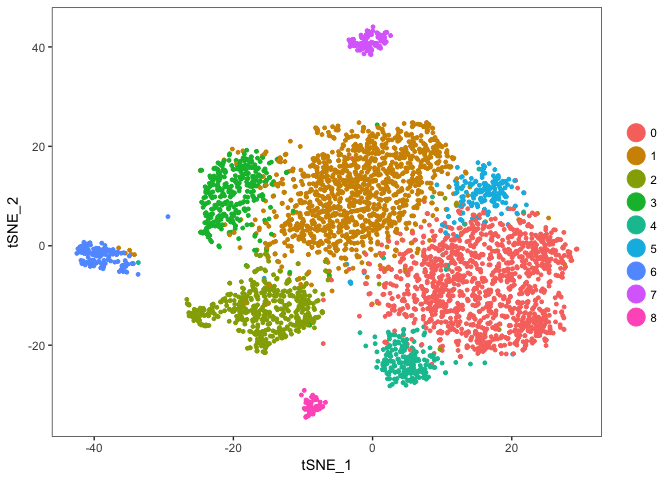<!-- -->

So we’ll want to remove clusters 2, 6, 7, and
8

``` r
follicle <- SubsetData(ovary.aligned, ident.use=c(0,1,3,4,5))
```

``` r
follicle <- FindVariableGenes(object = follicle, mean.function = ExpMean, 
                          dispersion.function = LogVMR,
                          x.low.cutoff = 0.0125, x.high.cutoff = 5, 
                          y.cutoff = 0.5)
```

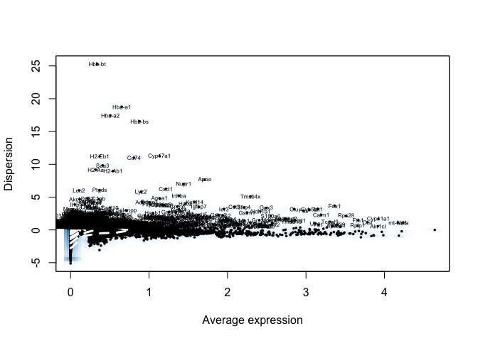<!-- -->

``` r
follicle <- RunPCA(follicle, pcs.compute=50, do.print=T, genes.print=5)
```

    ## [1] "PC1"
    ## [1] "Cyp11a1" "Fdx1"    "Me1"     "Gm2a"    "Mgarp"  
    ## [1] ""
    ## [1] "Serpine2" "Inha"     "Bex4"     "Car14"    "Nap1l5"  
    ## [1] ""
    ## [1] ""
    ## [1] "PC2"
    ## [1] "Fxyd1"   "Aldh1a1" "Igfbp7"  "Cyp17a1" "Ephx1"  
    ## [1] ""
    ## [1] "Ephx2"  "Sfrp4"  "Nrn1"   "S100a6" "Sgk1"  
    ## [1] ""
    ## [1] ""
    ## [1] "PC3"
    ## [1] "Mgarp"  "Inhba"  "Nap1l5" "Hao2"   "Fdx1"  
    ## [1] ""
    ## [1] "Tmsb4x" "Ier3"   "Itm2b"  "Thbs1"  "Phlda1"
    ## [1] ""
    ## [1] ""
    ## [1] "PC4"
    ## [1] "Fosb"   "Hmgcs2" "Ubc"    "Tenm4"  "Cyr61" 
    ## [1] ""
    ## [1] "Birc5" "Spc24" "Ube2c" "Cdca8" "Ccna2"
    ## [1] ""
    ## [1] ""
    ## [1] "PC5"
    ## [1] "Kctd14"   "Amh"      "Slc18a2"  "Tmem184a" "Aard"    
    ## [1] ""
    ## [1] "Fosb"    "Inhba"   "Cxcl1"   "Hsd17b1" "Nr4a1"  
    ## [1] ""
    ## [1] ""

``` r
PCAPlot(follicle)
```

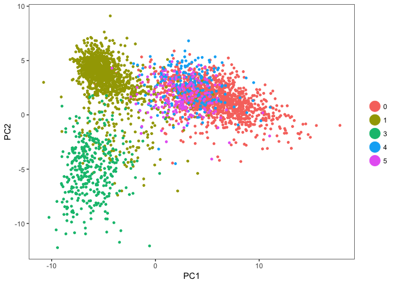<!-- -->

``` r
PCElbowPlot(object = follicle, num.pc=50)
```

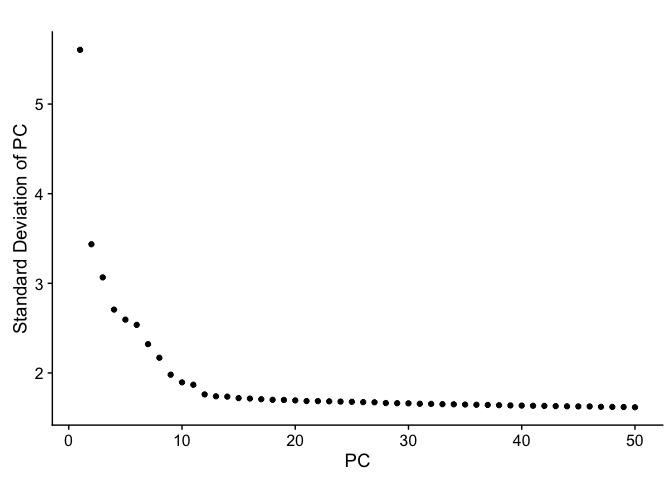<!-- -->

``` r
follicle <- RunTSNE(follicle, do.fast=T, dims.use=1:20)
```

``` r
TSNEPlot(follicle)
```

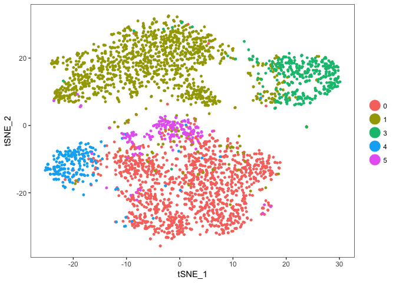<!-- -->

``` r
follicle <- RunDiffusion(follicle, q.use=0, genes.use=follicle@var.genes)
```

    ## Performing eigendecomposition
    ## Computing Diffusion Coordinates
    ## Elapsed time: 8.109 seconds

# Diffusion map

``` r
mat <- follicle@scale.data[follicle@var.genes,]
dm <- DiffusionMap(t(mat), sigma="local")
```

``` r
plot(dm, pch=20)
```

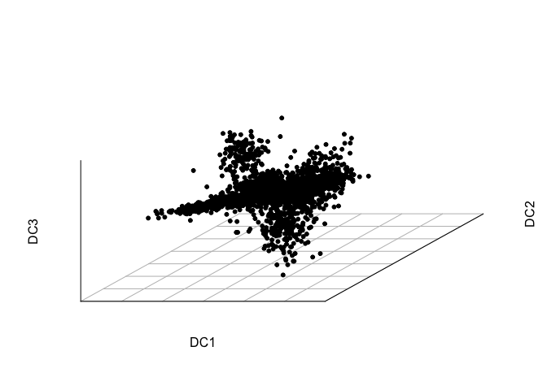<!-- -->

``` r
dm.embeddings <- dm@eigenvectors[,1:6]
colnames(dm.embeddings) <- paste0("DC", 1:6)
rownames(dm.embeddings) <- colnames(mat)
```

``` r
follicle <- SetDimReduction(follicle, reduction.type="diffmap", slot="cell.embeddings", new.data=dm.embeddings)
follicle <- SetDimReduction(follicle, reduction.type="diffmap", slot="key", new.data="DC")
```

``` r
DimPlot(follicle, reduction.use="diffmap")
```

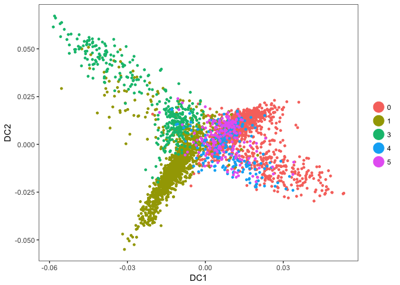<!-- -->

``` r
DimPlot(follicle, reduction.use="diffmap", dim.1=1, dim.2=3)
```

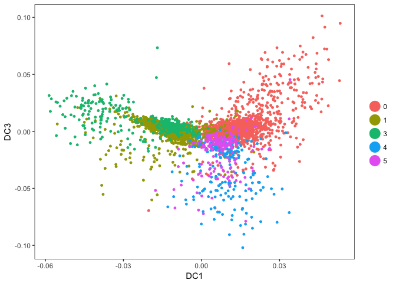<!-- -->

``` r
FeaturePlot(follicle, features.plot=c("Nap1l5", "Sfrp4", "Aldh1a1", "Kctd14", "Itm2b"), reduction.use="diffmap",
            cols.use=viridis(100))
```

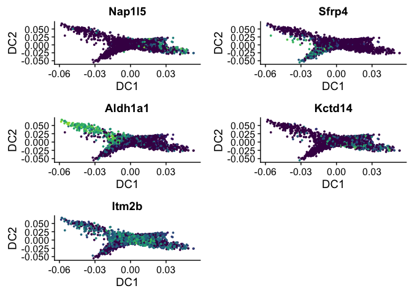<!-- -->
